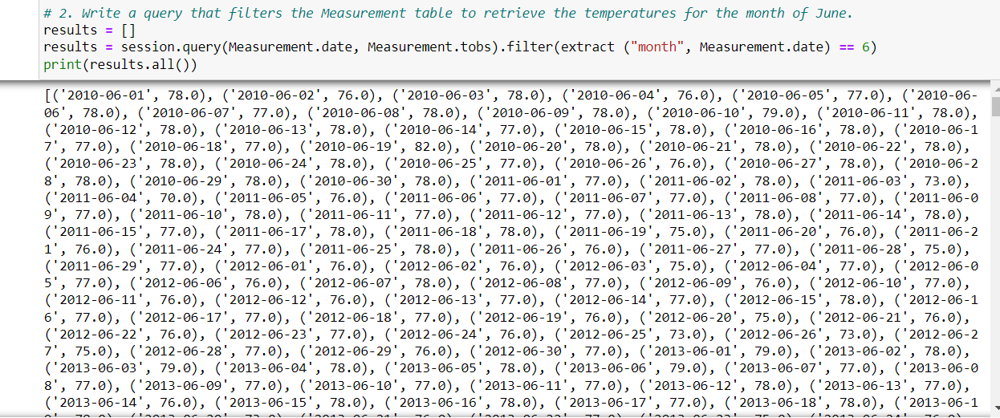
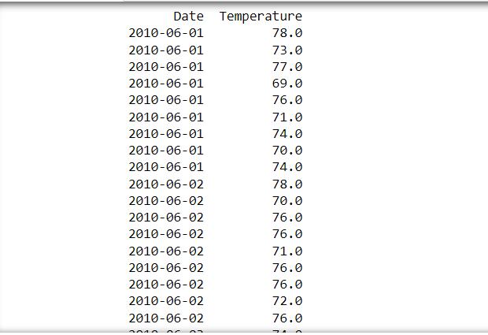
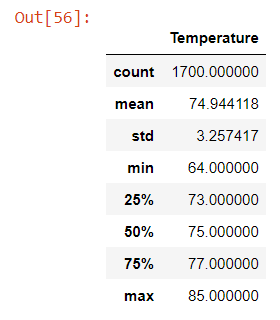
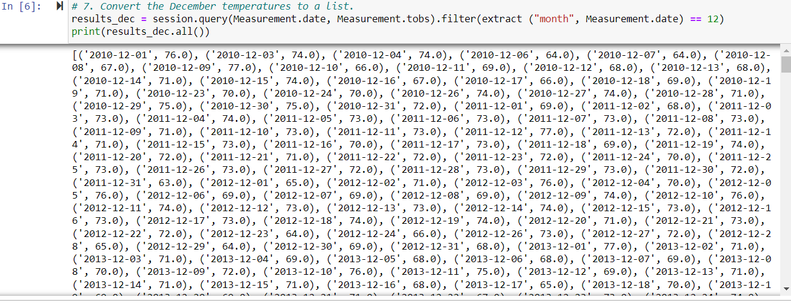
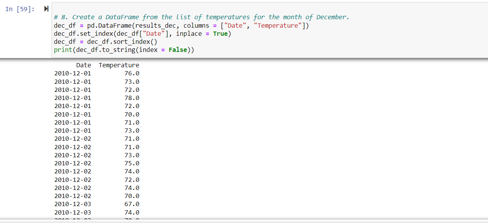
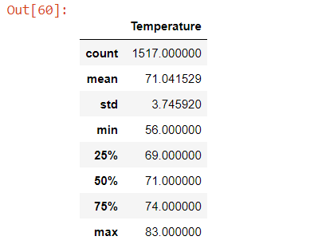

# Overview of the analysis: Explain the purpose of this analysis.

   Objective is to get temperature trends before opening the surf shop. In 
addition temperature data should be specific for the months of June and December in Oahu which will determine if the surf and ice cream shop business is sustainable all year.

# Results: Provide a bulleted list with three major points from the two analysis deliverables. Use images as support where needed.

June Temperature in List form:

June Temperature in Dataframe form:

June Summary Statistics:

Dec Temperature in List form:

June Temperature in Dataframe form:

June Summary Statistics:

#1 December has Coldest minimum temperature(56) as compared to in June(64). This expected as december in northern hemisphere has the elowest temperatures

#2 December has lesser counts as compared to June month.
   December count = 1517
   June count = 1700

#3 December has lower temperatures than June and so maximum temperature is higher in June(85) as compared to December(83)

#4 Listed below are percentile differences between Decemeber and June
   
   December percentiles: 
     25% 69 
     50% 71 
     75% 74
   June percentiles: 
     25% 73
     50% 75
     75% 77

# Summary: Provide a high-level summary of the results and two additional queries that you would perform to gather more weather data for June and December.

   Since December has lower temperatures, minimum and maximum numbers  
reflectthe same. Even if we look at percentiles, they reflect that temperatures are lower in December than June. 
   A query that reviews temperatures corresponding to stations would reflect 
if certain areas are warmer or colder than others. If time is also added, it would help in figuring out which month and what time of the day will be suitable for ice cream. Other additinal factor like percipitation will add value to to see if people can visit the shop

  
 

